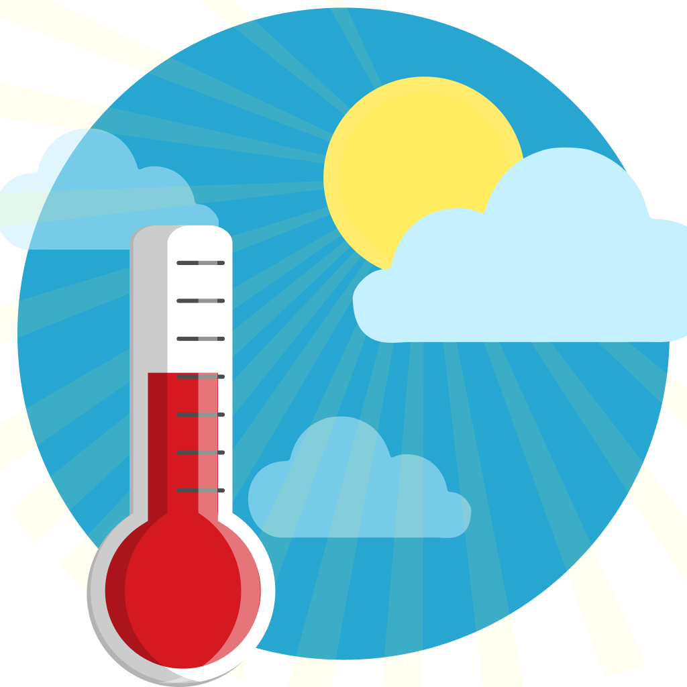
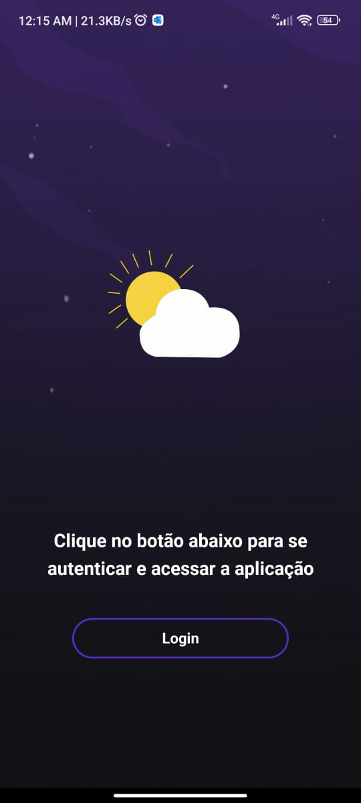
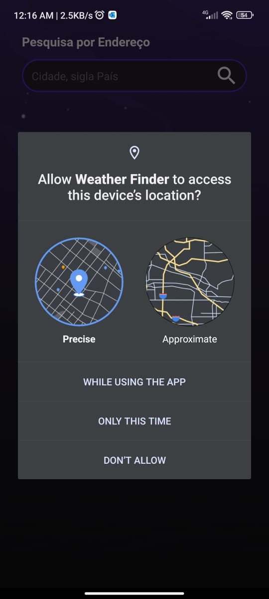

<div align="center" style="margin-bottom:10px; margin:auto" >
  
</div>

<h2 align="center" style="margin:50px">
   Weather Finder mobile app
</h2>

<hr/>

<br/>

<div align="center" style="margin-bottom:10px; margin:auto" >
  
  
  
  
  
</div>

<hr/>

<br/>

<div align="center">

  

  

  

  

</div>

<hr/>

<br/>

<div align="center">

  <a href="#-sobre-o-projeto">Sobre o projeto</a>&nbsp;&nbsp;-&nbsp;
  <a href="#-funcionalidades-obrigatórias">Funcionalidades Obrigatórias</a>&nbsp;&nbsp;-&nbsp;
  <a href="#-funcionalidades-bonus">Funcionalidades Bonus</a>&nbsp;&nbsp;-&nbsp;
  <a href="#-demo">Demo</a>&nbsp;&nbsp;-&nbsp;
  <a href="#-tecnologias-e-bibliotecas">Tecnologias e Bibliotecas</a>&nbsp;&nbsp;-&nbsp;
  <a href="#-testes">Testes</a>&nbsp;&nbsp;-&nbsp;
  <a href="#-roadmap">Roadmap</a>&nbsp;&nbsp;-&nbsp;
  <a href="#-executando-o-projeto">Executando o projeto</a>

</div>

<br/>

# 💡 Sobre o projeto

Este projeto foi construído como um teste técnico.
A proposta para este projeto foi criar um pequeno aplicativo móvel para permitir que os usuários buscassem o clima atual baseado na sua localização.

Esse projet foi construido usnado [**React Native**](https://reactnative.dev/) e [**typescript**](https://www.typescriptlang.org/)

- Para buscar os dados climáticos foi sugerida a API do Open Weather. 

- [Link da API Open Weather](https://openweathermap.org/api)
- [Download o Android app clicando aqui e teste no seu dispositivo](https://github.com/Fred-Reis/weather-finder/raw/main/android/app/build/outputs/apk/release/app-release.apk)

> Atenção - Se o link acima não funcionar, você pode encontrar o APK para teste nesse caminho: `android/app/build/outputs/apk/release/app-release.apk`

<br/>

# 🔥 Funcionalidades Obrigatórias

- Consumir a localização atual do usuário.
- Exibir na interface o endereço atual e os dados climáticos da região.
- Utilizar React Native.

<br/>

# 🎄 Funcionalidades Bonus

- ✅ Para dispositivos suportados, o usuário pode escolher se deseja permitir a autenticação por impressão digital para acessar o aplicativo ou então digitar o número do PIN.
- ✅ Permitir usuários buscar o clima por enderço.
- ✅ Testes unitários.

<br/>

## 👀 Demo

<h1 align="center">
  
</h1>

<br/>

## 🛠 Tecnologias e Bibliotecas

Some of technologies and libraries used at this project:

- [**Expo**](https://expo.dev/);
- [**typescript**](https://www.typescriptlang.org/);
- [**NativeBase**](https://nativebase.io/) => NativeBase é uma biblioteca de componentes para construir universal design systems;
- [**Lottie**](https://github.com/lottie-react-native/lottie-react-native) => Para animações;
- [**Async Storage**](https://react-native-async-storage.github.io/async-storage/) => Para armazenamento de dados no React Native.;
- [**expo-local-authentication**](https://docs.expo.dev/versions/latest/sdk/local-authentication) => Para permitir usuários acessar o app usando FaceID e TouchID (iOS) ou leitor de digitais (Android).;
- [**Jest**](https://jestjs.io/) => Para testes.
- [**expo-location**](https://docs.expo.dev/versions/latest/sdk/location/) => Para acessar a api de geolocalização do dispositivo.

<br/>

## 🧪 Testes

 Foi iniciada a implementação de testes unitários nesse projeto usando:
  [Jest](https://jestjs.io/);

  Para rodar os testes unitários execute o seguinte comando na raiz do projeto:

  ```bash
  $ yarn test
  ```
  Se preferir, execute o comando abaixo para gerar uma pasta com a cobertura dos testes.

```bash
$ yarn test --coverage
```

<br/>

## 🗺 Roadmap
   
[ ] Finalizar todos os testes usando [**Jest**](https://jestjs.io/)  
[ ] Integrar o app com [**Bitrise**](https://www.bitrise.io/) => Para CI/CD;  

<br/>

## 🏁 Executando o projeto

1 - Para executar pela primeira vez o seu projeto será necessário a criação de uma pasta.

```bash
mkdir <nome-da-pasta>
```

2 - Agora entre na pasta criada.

```bash
cd <nome-da-pasta>
```

3 - Vamos clonar o repositório.

```bash
git clone https://github.com/Fred-Reis/weather-finder
```

4 -  Execute o comando a seguir para a criação da pasta  `node_modules`.

```bash
yarn
```

5 - Para instalar as dependencias para IOS usando cocoa pods:

```bash
$ cd ios

$ pod install
```

6 - Agora, se você deseja executar este projeto no emulador ou dispositivo no modo de desenvolvimento, execute este comando usando sua plataforma preferida.

```bash
$ npx react-native run-<platforma-escolhida>
```

<br/>


<h4 align="center">
😃  <strong>BE HAPPY!</strong>
</h4>

<h4 align="center">
  "Stay hungry stay foolish!"
</h4>

<br/>

<hr/>

<br/>

<h3 align="center">
Author: <a alt="Fred-Reis" href="https://github.com/Fred-Reis">Frederico Reis</a>
</h3>

<p align="center">

  <a alt="Frederico Reis" href="https://www.linkedin.com/in/frederico-reis-dev/">
    </a>
  <a alt="Frederico Reis" href="https://github.com/Fred-Reis ">
  </a>

</p>

<p align="center">Made with ♥️ 2022</p>
